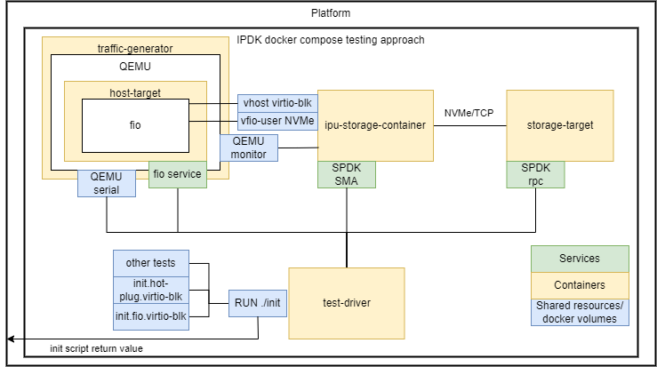

# Introduction
These tests covers the recipes described in [recipes](../../recipes/README.md)
directory.

In addition to [the main IPDK images](../../README.md#main-components),
the following images are introduced for testing purposes:
- _traffic-generator_ which has a vm instance on board exposing interfaces for
access to the vm instance.
- _test-driver_ container used to exercise the scenario by running
dedicated tests(apply a specific storage configuration, check if hot-plugged
devices are visible on host, run traffic from host and etc.).

All containers are run in the isolated docker compose environment described by
`docker-compose` files. It allows to configure the environment to run tests in
a flexible way.
The figure below illustrates the overall testing design:


# Test environment preparation
Please make sure that steps described in
[System setup](../../recipes/environment_setup.md#system-setup)
section are performed on testing platform.

For testing environment additionally the steps bellow should be applied:

## docker compose setup
```
$ sudo curl -L "https://github.com/docker/compose/releases/download/1.29.2/docker-compose-$(uname -s)-$(uname -m)" -o /usr/local/bin/docker-compose
$ sudo chmod +x /usr/local/bin/docker-compose
$ sudo ln -s /usr/local/bin/docker-compose /usr/bin/docker-compose
```

# Running the tests
In order to run all defined tests
```
$ ./run.sh
```
or if there is a proxy
```
$ https_proxy=<https_proxy> \
http_proxy=<http_proxy> \
no_proxy=<no_proxy> \
./run.sh
```

To run a specific test
```
$ ./run.sh <name_of_test>
```
for example
```
$ ./run.sh hot-plug
$ # or
$ ./run.sh fio
```
The script `run.sh` returns a non-zero value only in case of an error.

**Note:**
The script `run.sh` will download a `Fedora 36` image into `traffic-generator`
directory and set up login-password pair as root-root if there is no `vm.qcow2`
image provided in that directory. `run.sh` will also try to allocate 2048 2MB
hugepages if not yet allocated and it will request administrative privileges
to execute this operation.